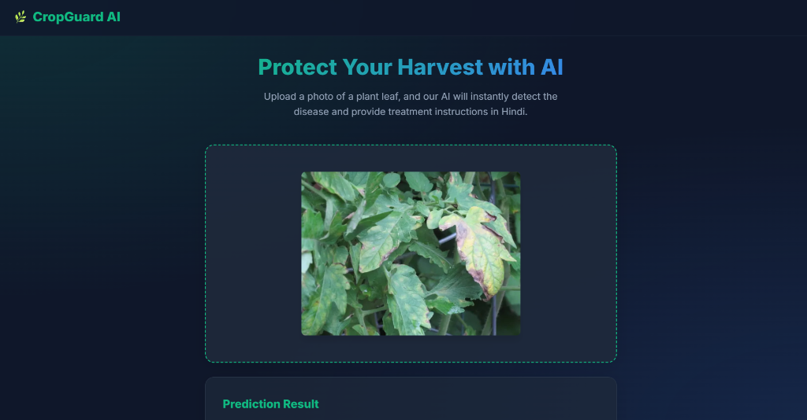
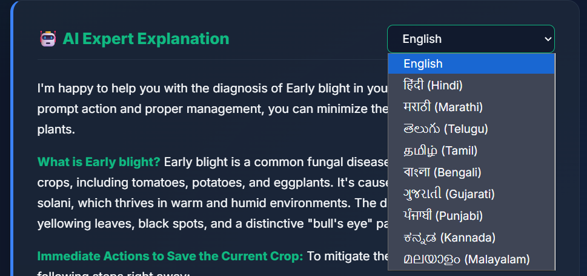
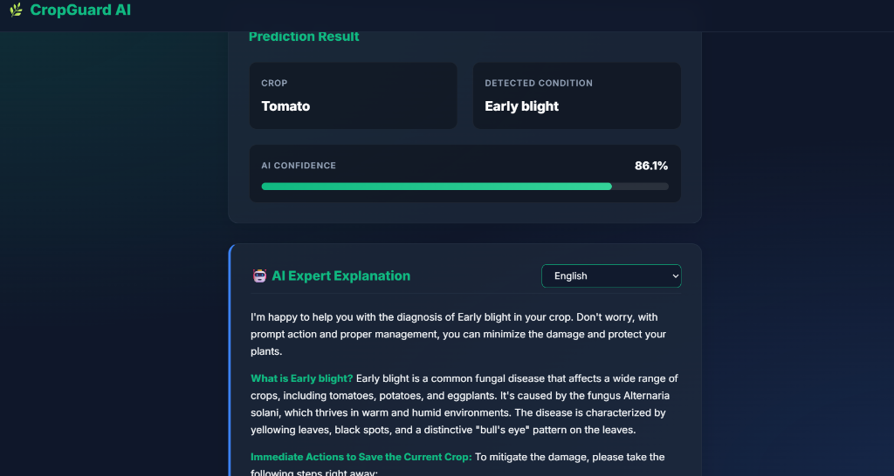
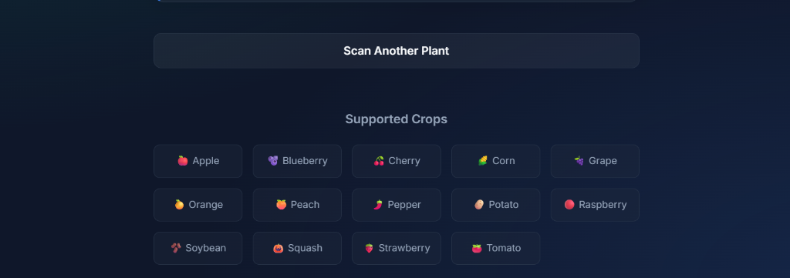

# 🌿 CropGuard AI

**CropGuard AI** is an intelligent crop disease detection web application that helps farmers and agricultural enthusiasts quickly identify plant diseases and get actionable, AI-powered treatment advice.



## ✨ Features

- **Instant Disease Detection:** Upload a photo of a plant leaf, and our MobileNetV2-based model will analyze it instantly.
- **High Accuracy:** Trained on the PlantVillage dataset with a 97% accuracy rate across 38 different crop disease categories.
- **Multilingual AI Expert:** Powered by LLaMA 3.3 (via Groq API), the app provides detailed, localized treatment and prevention advice. 
  - *Supported Languages:* English, Hindi, Marathi, Telugu, Tamil, Bengali, Gujarati, Punjabi, Kannada, and Malayalam.
- **Confidence Meter:** A color-coded, animated progress bar indicates how confident the AI is in its prediction.
- **Low Confidence Warnings:** Graceful fallbacks and warnings if the image is blurry or the plant is unrecognized.
- **Premium Glassmorphism UI:** A beautiful, responsive, dark-mode nature theme built with pure HTML, CSS, and JS.

---

## 📸 Screenshots

| Upload & Analyze | AI Expert Explanation & Translations |
|:---:|:---:|
|  |  |

| Available Crops Options | |
|:---:|:---:|
|  | |

---

## 🛠️ Technology Stack

**Frontend:**
- HTML5, CSS3 (Glassmorphism design, CSS Grid/Flexbox)
- Vanilla JavaScript (Async/Await, DOM manipulation)
- Markdown rendering (Marked.js)

**Backend:**
- Python 3
- FastAPI (High-performance API routing)
- TensorFlow / Keras (MobileNetV2 Inference)
- Groq API (LLaMA 3.3 for AI explanations)
- Uvicorn (ASGI Server)

**Machine Learning:**
- Model: MobileNetV2 (Fine-tuned)
- Dataset: PlantVillage (54,000+ images)
- Output: 38 Classes (14 Crops)

---

## 🚀 Getting Started

### Prerequisites
- Python 3.9+
- A [Groq API Key](https://console.groq.com/)

### Installation

1. **Clone the repository:**
   ```bash
   git clone https://github.com/yourusername/cropguard-ai.git
   cd cropguard-ai
   ```

2. **Set up a virtual environment (optional but recommended):**
   ```bash
   python -m venv venv
   source venv/bin/activate  # On Windows: venv\Scripts\activate
   ```

3. **Install dependencies:**
   ```bash
   pip install -r backend/requirements.txt
   ```

4. **Set your Groq API Key:**
   Set the environment variable in your terminal before running the app.
   ```bash
   # On Windows (Command Prompt)
   set GROQ_API_KEY=your_api_key_here
   
   # On Windows (PowerShell)
   $env:GROQ_API_KEY="your_api_key_here"
   
   # On macOS/Linux
   export GROQ_API_KEY="your_api_key_here"
   ```

5. **Run the server:**
   ```bash
   uvicorn backend.main:app --reload
   ```

6. **Open the app:**
   Visit `http://127.0.0.1:8000` in your web browser.

---

## 📁 Project Structure

```text
cropguard-ai/
│
├── backend/
│   ├── main.py                 # FastAPI application & ML inference
│   ├── requirements.txt        # Python dependencies
│   ├── models/
│   │   ├── crop_disease_model.h5   # Trained TensorFlow model
│   │   └── class_names.json        # 38-class label mapping
│   └── uploads/                # Temporary storage for scanned images
│
├── frontend/
│   ├── index.html              # Main UI
│   ├── css/
│   │   └── style.css           # Premium Glassmorphism styling
│   └── js/
│       └── app.js              # Frontend logic and API calls
│
└── notebooks/
    └── crop_disease_training.ipynb  # ML Model training notebook
```

---

## 🌱 Supported Crops

Apple 🍎 | Blueberry 🫐 | Cherry 🍒 | Corn 🌽 | Grape 🍇 
Orange 🍊 | Peach 🍑 | Pepper 🌶️ | Potato 🥔 | Raspberry 🔴 
Soybean 🫘 | Squash 🎃 | Strawberry 🍓 | Tomato 🍅

---
